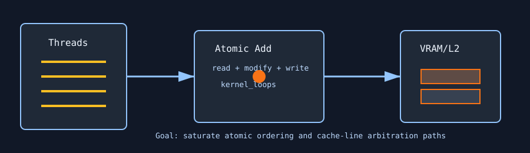

# Atomic Virus

`atomic_virus` is an L2/cache-arbiter stress test. It repeatedly performs atomic adds across a large VRAM allocation, forcing read-modify-write traffic that is harder on cache arbitration and memory ordering than plain reads or writes.



## What It Stresses

| Area | Stress mechanism |
| :--- | :--- |
| L2 cache arbiters | Many threads contend on atomic read-modify-write paths. |
| Memory fabric | Wide grid-stride access walks a large allocation. |
| Ordering hardware | Atomic operations force serialization at cache-line granularity. |
| Retention/correctness | Optional verification checks the expected atomic count. |

## How It Works

1. The test uses `--mem` percent of available VRAM to size the buffer, but **the implementation clamps the allocation** (currently 128 MiB max) so each kernel launch finishes in bounded time. On very large GPUs, `--mem 99` would otherwise imply trillions of atomics **per launch** before the next `hipDeviceSynchronize`, and the host watchdog (`duration + 30` s in `pantheon.py`) would SIGKILL the process with exit code **-9** while telemetry still shows `0.0 ERR`. For a true “almost full VRAM” allocation check, use a different test; keep `atomic_virus` for L2/atomic stress at the clamped footprint.
2. Memory is initialized to zeroes or ones.
3. Each thread walks the allocation as `uint4` storage reinterpreted as `unsigned int`.
4. For each visited integer, the kernel performs `kernel_loops` atomic adds.
5. Warmup updates are reset before the measured phase so verification has a clean baseline.
6. With `--verify`, the final values are compared against the expected launch count.

## Command Examples

```bash
pantheon --test atomic_virus --gpu 0 --duration 30 --mem 60
pantheon --test atomic_virus --gpu 0 --duration 30 --mem 60 --verify
```

## Runtime Parameters

| Parameter | Default | Effect |
| :--- | ---: | :--- |
| `block_size` | `256` | Threads per block. |
| `grid_size` | `0` | Number of blocks. `0` means auto-calculate from occupancy. |
| `kernel_loops` | `100` | Atomic adds per visited integer. |
| `warmup_iters` | `5` | Warmup launches before telemetry, followed by a memory reset. |
| `sync_mode` | `2` | `0=Spin`, `1=Yield`, `2=Block`. |
| `init_pattern` | `0` | `0=Zeroes`, `1=Ones`. |

## Output And Interpretation

`Throughput` is reported in `MAPS`: million atomic operations per second. Higher MAPS means more atomic traffic, but the most stressful configuration may be the one that produces higher power, temperature, or throttle signals rather than raw throughput.

## Failure Signals

| Symptom | Possible meaning |
| :--- | :--- |
| Verification mismatch | Atomic count mismatch, cache/L2 fault, or injected corruption. |
| Very low MAPS | Severe atomic serialization, throttling, or too much memory footprint. |
| High power with modest MAPS | Useful stress point: the fabric is busy even when progress is slow. |

## Source

The implementation lives in [`atomic_virus.cpp`](./atomic_virus.cpp).
