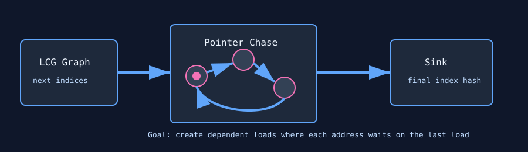

# Cache Latency

`cache_latency` is a pointer-chasing latency stress test. It creates a power-of-two random-walk graph in VRAM and has each thread repeatedly follow dependent pointers, making each load depend on the previous load result.



## What It Stresses

| Area | Stress mechanism |
| :--- | :--- |
| Cache latency | Dependent pointer chasing prevents broad memory-level parallelism. |
| L1/L2 behavior | Randomized traversal defeats simple coalescing and locality. |
| Memory dependency handling | Each next address is unknown until the current load returns. |
| Silent data corruption | Optional golden-pass verification checks final pointer-chain state. |

## How It Works

1. The test allocates `--mem` percent of free VRAM and rounds the node count down to a power of two.
2. Initialization fills the node array with an LCG-derived next-index mapping.
3. Each thread starts from `tid & (n - 1)`.
4. The stress kernel follows `kernel_loops` dependent pointers.
5. The final index is accumulated into a sink buffer.
6. With `--verify`, a golden pass computes the expected final index for each thread.

## Command Examples

```bash
pantheon --test cache_latency --gpu 0 --duration 30 --mem 90
pantheon --test cache_latency --gpu 0 --duration 30 --mem 90 --verify
```

## Runtime Parameters

| Parameter | Default | Effect |
| :--- | ---: | :--- |
| `block_size` | `256` | Threads per block. |
| `grid_size` | `0` | Number of blocks. `0` means auto-calculate from occupancy. |
| `kernel_loops` | `20000` | Dependent pointer hops per launch. |
| `warmup_iters` | `5` | Warmup launches before telemetry. |
| `sync_mode` | `2` | `0=Spin`, `1=Yield`, `2=Block`. |
| `init_pattern` | `0` | Logged only; pointer generation is forced to the LCG graph for safety. |

## Output And Interpretation

This test intentionally prioritizes latency pressure over raw bandwidth. A stressful result may show modest throughput-style progress but high latency sensitivity, power, or throttle signals. It is useful for finding failures that bandwidth-oriented tests can miss.

## Failure Signals

| Symptom | Possible meaning |
| :--- | :--- |
| Verification mismatch | Wrong pointer-chain result, memory corruption, or injected fault. |
| Allocation failure | `--mem` leaves too little headroom or exceeds available VRAM. |
| Unexpectedly fast traversal | Working set may fit too well in cache for the selected memory size. |

## Source

The implementation lives in [`cache_latency.cpp`](./cache_latency.cpp).
