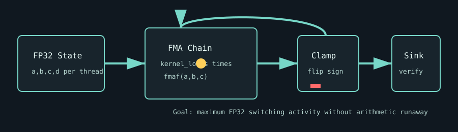

# Compute Virus

`compute_virus` is Pantheon's FP32 voltage-droop stress test. It runs long FMA chains with periodic polarity flips to keep scalar ALUs busy while avoiding runaway values, NaNs, and compiler elimination.

This page documents the standard `compute_virus` test. The same source directory also contains the aggressive `compute_virus_agg` variant.



## What It Stresses

| Area | Stress mechanism |
| :--- | :--- |
| FP32 ALUs | Dense `fmaf` chains across many resident threads. |
| Voltage stability | Rapid sign changes and sustained math load create high switching activity. |
| Scheduler occupancy | Auto grid sizing tries to fill each SM/CU with active blocks. |
| Silent data corruption | Optional bitwise verification compares every thread against a golden result. |

## How It Works

1. The test chooses a launch grid from `grid_size` or device occupancy.
2. Each thread initializes stable FP32 state values.
3. The active kernel runs `kernel_loops` FMA iterations per launch.
4. Every 256 iterations, values are polarity-flipped or clamped to stay finite.
5. The final value is written to a sink buffer so the work remains observable.
6. With `--verify`, the sink is compared bit-for-bit against a golden value.

## Command Examples

```bash
pantheon --test compute_virus --gpu 0 --duration 30 --mem 99
pantheon --test compute_virus --gpu 0 --duration 30 --verify
```

## Runtime Parameters

| Parameter | Default | Effect |
| :--- | ---: | :--- |
| `block_size` | `256` | Threads per block. |
| `grid_size` | `0` | Number of blocks. `0` means auto-calculate from occupancy. |
| `kernel_loops` | `20000` | FMA loop iterations per launch. |
| `warmup_iters` | `5` | Warmup launches before telemetry. |
| `sync_mode` | `2` | `0=Spin`, `1=Yield`, `2=Block`. |
| `init_pattern` | `0` | Sink initialization. `0=Zeroes`, `1=Ones`. |

## Output And Interpretation

`Throughput` is reported in `TFLOPS`. The most useful stress signals are max/average board power, core temperature rise, and any throttle reason. A lower-than-expected TFLOPS value with high power can indicate throttling or scheduling pressure; low power and low TFLOPS can indicate under-occupancy.

## Failure Signals

| Symptom | Possible meaning |
| :--- | :--- |
| Verification fault | FP32 arithmetic corruption or injected fault. |
| NaN-like throughput collapse | Unstable parameter combination or compiler/runtime issue. |
| Power limit reason | The workload is hitting board or driver power policy. |

## Source

The implementation lives in [`compute_virus.cpp`](./compute_virus.cpp).
