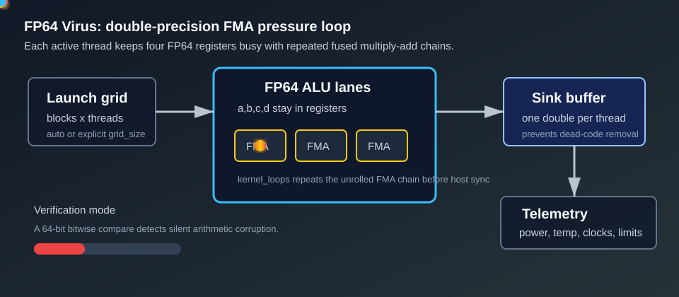

# FP64 Virus

`fp64_virus` is a double-precision arithmetic stress test. It is designed to expose the physical FP64 throughput limits of a GPU by keeping double-precision FMA lanes busy for the full active test window.



## What It Stresses

| Area | Stress mechanism |
| :--- | :--- |
| FP64 ALUs | Repeated fused multiply-add operations on 64-bit floating-point registers. |
| Scheduler / occupancy | A grid of blocks is launched across the GPU, either auto-sized or explicitly set. |
| Power delivery | Dense FP64 execution can create sustained high current draw on cards with meaningful FP64 hardware. |
| Thermal behavior | The active loop runs until the requested duration expires, letting telemetry capture sustained heat and power. |
| Silent data corruption | Optional verification compares final 64-bit output patterns across all participating threads. |

Consumer GPUs often have intentionally limited FP64 throughput, so this workload may show lower TFLOPS than FP32 or tensor-heavy tests while still revealing throttling, clock behavior, or unusual power response.

## How It Works

1. The host selects the target GPU and configures the requested sync mode.
2. The test calculates a launch grid from `grid_size` or derives one from the GPU multiprocessor count and `block_size`.
3. Each thread initializes four double-precision registers: `a`, `b`, `c`, and `d`.
4. Inside the kernel, each thread repeatedly runs an unrolled chain of FP64 FMA operations.
5. Every 256 outer iterations, the kernel flips/clamps selected values to keep the math bounded and avoid `NaN` or infinity.
6. Each thread writes one final `double` to a sink buffer so the compiler cannot remove the arithmetic.
7. The host repeats launches until `--duration` has elapsed and reports aggregate FP64 throughput in `TFLOPS`.

## Command Examples

Run a normal 30-second FP64 stress test on GPU 0:

```bash
pantheon --test fp64_virus --gpu 0 --duration 30 --mem 99
```

Run with silent data corruption verification:

```bash
pantheon --test fp64_virus --gpu 0 --duration 30 --verify
```

Use the tuning agent to explore variants:

```bash
```

Force a specific kernel-loop variant:

```bash
```

Run two concurrent FP64 instances:

```bash
```

## Runtime Parameters


| Parameter | Default | Effect |
| :--- | ---: | :--- |
| `block_size` | `256` | Threads per block. Larger values can alter occupancy and scheduling pressure. |
| `grid_size` | `0` | Number of blocks. `0` means auto-calculate from GPU properties. |
| `kernel_loops` | `10000` | Number of outer FP64 loop iterations per kernel launch. Higher values reduce host synchronization frequency. |
| `warmup_iters` | `5` | Number of warmup launches before active telemetry begins. |
| `sync_mode` | `2` | Host/device sync behavior: `0=Spin`, `1=Yield`, `2=Block`. |
| `init_pattern` | `0` | Initial sink-buffer pattern: `0=Zeroes`, `1=Ones`. |

## Output And Interpretation

The test prints its resolved parameters at startup, including the calculated grid size. Pantheon records the trial in `summary.csv` / `summary.xlsx` for normal runs.

Key fields to watch:

| Field | Meaning |
| :--- | :--- |
| `Score` / `Unit` | Reported FP64 throughput in `TFLOPS`. |
| `Max Power (W)` | Peak board power observed during the run. |
| `Avg Power (W)` | Sustained board power during active telemetry. |
| `Max Temp (C)` | Peak core temperature. |
| `Max Mem Temp (C)` | Peak memory temperature, if exposed by the platform. |
| `Limit Reason` | Reported throttle or clock limit signal. |

## Failure Signals

| Symptom | What it may indicate |
| :--- | :--- |
| `Status=FAIL` with `--verify` | Silent arithmetic corruption or injected error detection. |
| Low TFLOPS but high power | FP64 hardware ratio bottleneck or aggressive power limiting. |
| High `Limit Reason` frequency | Power, thermal, or clock throttling during sustained FP64 pressure. |
| Process timeout or driver reset | Driver watchdog, unstable overclock, insufficient cooling, or power delivery instability. |

## Source

The implementation lives in [`fp64_virus.cpp`](./fp64_virus.cpp).
