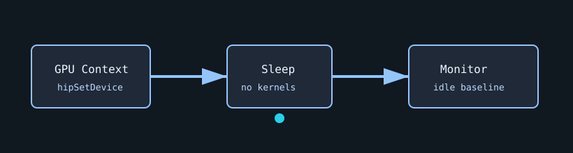

# Idle

`idle` is the baseline telemetry test. It creates a valid GPU context, launches no kernels, sleeps for the requested duration, and lets the monitor record idle temperature, power, clocks, and utilization.



## What It Stresses

| Area | Stress mechanism |
| :--- | :--- |
| Baseline monitor path | Captures telemetry while the GPU is intentionally idle. |
| GPU context setup | Verifies the selected GPU can be opened by the runtime. |
| Result plumbing | Emits a dummy throughput line so normal result parsing works. |

## How It Works

1. The test selects the requested GPU.
2. No GPU kernels are launched.
3. The process sleeps for `--duration` seconds.
4. The monitor records the idle baseline for comparison against stress tests.

## Command Examples

```bash
pantheon --test idle --gpu 0 --duration 30 --mem 1
```

## Output And Interpretation

`Throughput` is always `0.0 GB/s`. Use this test to understand idle board power, starting core temperature, memory temperature, fan behavior, and background throttle states before comparing stress workloads.

## Source

The implementation lives in [`idle.cpp`](./idle.cpp).
