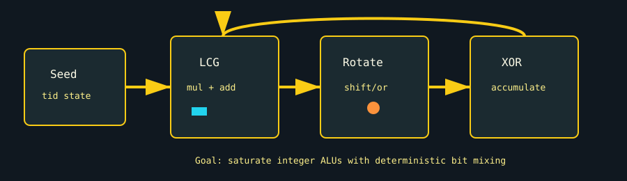

# INT Virus

`int_virus` is an INT32 arithmetic stress test. It hammers integer execution paths with LCG-style multiply/add operations, bit rotations, XOR cascades, and integer additions.



## What It Stresses

| Area | Stress mechanism |
| :--- | :--- |
| INT32 ALUs | Repeated integer multiply, add, rotate, and XOR operations. |
| Non-FP datapaths | Exercises a different execution path than FP16/FP32/FP64 tests. |
| Scheduler occupancy | Auto grid sizing attempts to keep SM/CU integer lanes busy. |
| Silent data corruption | Optional golden-pass verification checks accumulated integer state. |

## How It Works

1. The test chooses a launch grid from `grid_size` or device occupancy.
2. Each thread seeds three integer state values from its thread ID.
3. For each `kernel_loops` iteration, an inner loop is unrolled 32 times.
4. The inner loop performs LCG math, bit rotation, XOR mixing, and integer addition.
5. The final mixed integer state is accumulated into a sink buffer.
6. With `--verify`, a golden pass computes the expected per-thread value and compares the accumulated result.

## Command Examples

```bash
pantheon --test int_virus --gpu 0 --duration 30 --mem 99
pantheon --test int_virus --gpu 0 --duration 30 --verify
```

## Runtime Parameters

| Parameter | Default | Effect |
| :--- | ---: | :--- |
| `block_size` | `256` | Threads per block. |
| `grid_size` | `0` | Number of blocks. `0` means auto-calculate from occupancy. |
| `kernel_loops` | `10000` | INT32 outer-loop iterations per launch. |
| `warmup_iters` | `5` | Warmup launches before telemetry. |
| `sync_mode` | `2` | `0=Spin`, `1=Yield`, `2=Block`. |
| `init_pattern` | `0` | Sink initialization. `0=Zeroes`, `1=Ones`. |

## Output And Interpretation

`Throughput` is reported in `TOPS` because the work is integer math, not floating point. Compare it with power, core temperature, and throttle reason. This test is useful when FP-heavy workloads look stable but integer-heavy shader/compute paths need coverage.

## Failure Signals

| Symptom | Possible meaning |
| :--- | :--- |
| Verification mismatch | INT32 ALU corruption or injected fault. |
| Low TOPS | Under-occupancy, integer pipeline throttling, or excessive synchronization. |
| Different power profile than FP tests | Integer datapath stresses a distinct execution mix. |

## Source

The implementation lives in [`int_virus.cpp`](./int_virus.cpp).
