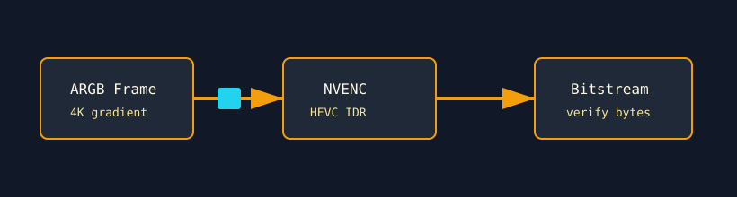

# Media Encode Virus

`media_enc_virus` stresses NVIDIA's NVENC hardware encoder. It creates a 4K HEVC high-quality encode session, initializes a deterministic ARGB frame, and repeatedly encodes independent IDR frames.



## What It Stresses

| Area | Stress mechanism |
| :--- | :--- |
| NVENC engine | Sustained 4K HEVC P7 encode workload. |
| CUDA/NVENC interop | Uses the CUDA primary context and NVENC input buffers. |
| Video memory path | Initializes and feeds deterministic ARGB frame data. |
| Bitstream determinism | Optional verification compares encoded output against a golden frame. |

## How It Works

1. The test requires NVIDIA CUDA and `libnvidia-encode.so.1`.
2. It opens an NVENC session bound to the selected GPU.
3. It configures 3840x2160 HEVC constant-QP encoding.
4. A CUDA kernel fills the input frame with a deterministic gradient.
5. The active loop repeatedly encodes forced-IDR frames.
6. With `--verify`, encoded bitstreams are compared against a golden baseline.

## Command Examples

```bash
pantheon --test media_enc_virus --gpu 0 --duration 30 --mem 1
pantheon --test media_enc_virus --gpu 0 --duration 30 --verify
```

## Output And Interpretation

`Throughput` is reported in `FPS`. A skip with `0.0 FPS` means the platform is not NVIDIA CUDA or the NVENC driver library is unavailable.

## Source

The implementation lives in [`media_enc_virus.cpp`](./media_enc_virus.cpp).
