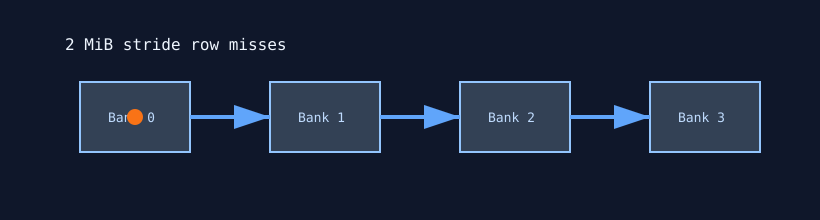

# Memory Bank Thrash

`memory_bank_thrash` stresses VRAM row/bank behavior by reading across fixed 2 MiB strides. The access pattern is designed to create row-buffer misses and pressure the memory controller rather than maximize coalesced bandwidth.



## What It Stresses

| Area | Stress mechanism |
| :--- | :--- |
| VRAM banks/rows | Repeated 2 MiB jumps target row-miss behavior. |
| Memory controller | Sustained nonlocal reads across a large allocation. |
| Data correctness | Optional verification checks accumulated read values. |

## How It Works

1. The test allocates `--mem` percent of free VRAM.
2. Memory is initialized to zeroes or ones.
3. Each thread starts at a staggered offset.
4. Reads jump by 131072 `uint4` elements, equivalent to 2 MiB.
5. Per-thread accumulators are verified when `--verify` is enabled.

## Command Examples

```bash
pantheon --test memory_bank_thrash --gpu 0 --duration 30 --mem 90
```

## Runtime Parameters

| Parameter | Default | Effect |
| :--- | ---: | :--- |
| `block_size` | `256` | Threads per block. |
| `grid_size` | `0` | Number of blocks. `0` means auto-calculate. |
| `kernel_loops` | `50000` | Bank-stride reads per launch. |
| `warmup_iters` | `5` | Warmup launches before telemetry. |
| `sync_mode` | `2` | `0=Spin`, `1=Yield`, `2=Block`. |
| `init_pattern` | `0` | `0=Zeroes`, `1=Ones`. |

## Source

The implementation lives in [`memory_bank_thrash.cpp`](./memory_bank_thrash.cpp).
