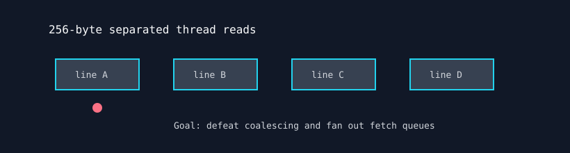

# Memory Cache Fracture

`memory_cache_fracture` stresses cache-line fetch behavior with deliberately uncoalesced reads. Neighboring threads are separated by 256 bytes, forcing many distinct cache-line requests per instruction.



## What It Stresses

| Area | Stress mechanism |
| :--- | :--- |
| Cache-line fetch queues | Threads in a wave request separated lines. |
| Memory coalescer | 256-byte spacing prevents normal merge behavior. |
| VRAM read path | Non-temporal reads force physical memory traffic. |
| Data correctness | Optional verification checks accumulated reads. |

## How It Works

1. The test allocates `--mem` percent of free VRAM.
2. Each thread starts `16` `uint4` elements away from its neighbor.
3. The kernel performs non-temporal reads and advances the base index.
4. Accumulated read values are checked when `--verify` is enabled.

## Command Examples

```bash
pantheon --test memory_cache_fracture --gpu 0 --duration 30 --mem 90
```

## Runtime Parameters

| Parameter | Default | Effect |
| :--- | ---: | :--- |
| `block_size` | `256` | Threads per block. |
| `grid_size` | `0` | Number of blocks. `0` means auto-calculate. |
| `kernel_loops` | `10000` | Uncoalesced reads per launch. |
| `warmup_iters` | `5` | Warmup launches before telemetry. |
| `sync_mode` | `2` | `0=Spin`, `1=Yield`, `2=Block`. |
| `init_pattern` | `0` | `0=Zeroes`, `1=Ones`. |

## Source

The implementation lives in [`memory_cache_fracture.cpp`](./memory_cache_fracture.cpp).
