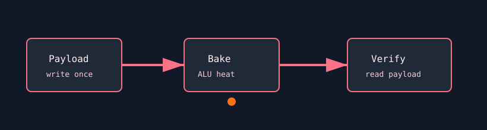

# Memory Retention Bake

`memory_retention_bake` writes a known payload into VRAM, then generates heat with an ALU burn while leaving the payload resident. It is meant to expose thermal retention or charge-leakage faults.



## What It Stresses

| Area | Stress mechanism |
| :--- | :--- |
| VRAM retention | Data remains resident while the GPU is heated. |
| Thermal coupling | A pure ALU bake raises temperature without rewriting the payload. |
| Data correctness | Optional verification reads the payload with non-temporal loads. |

## How It Works

1. The test allocates `--mem` percent of VRAM.
2. A deterministic payload is written to the allocation.
3. The active phase repeatedly launches an FP32 ALU bake kernel.
4. With `--verify`, the original payload is read back and compared.

## Command Examples

```bash
pantheon --test memory_retention_bake --gpu 0 --duration 60 --mem 90 --verify
```

## Runtime Parameters

| Parameter | Default | Effect |
| :--- | ---: | :--- |
| `block_size` | `256` | Threads per block. |
| `grid_size` | `0` | Number of blocks. `0` means auto-calculate. |
| `kernel_loops` | `50000` | ALU bake iterations per launch. |
| `warmup_iters` | `5` | ALU-only warmup launches before telemetry. |
| `sync_mode` | `2` | `0=Spin`, `1=Yield`, `2=Block`. |
| `init_pattern` | `2` | `0=Zeroes`, `1=Ones`, `2=hex retention pattern`. |

## Source

The implementation lives in [`memory_retention_bake.cpp`](./memory_retention_bake.cpp).
