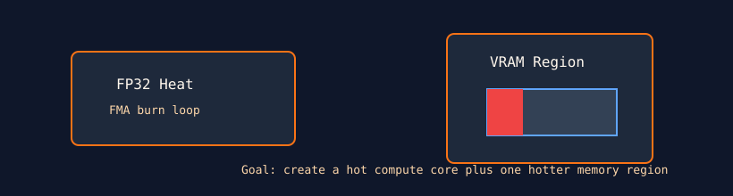

# Memory Thermal Asymmetry

`memory_thermal_asym` combines compute heat with localized writes to a constrained VRAM region. It is designed to create an asymmetric thermal load across memory stacks or channels.



## What It Stresses

| Area | Stress mechanism |
| :--- | :--- |
| Localized VRAM heating | Writes are confined to a bounded allocation. |
| Compute plus memory coupling | FP32 burn runs alongside repeated stores. |
| Physical memory integrity | Optional verification checks the written pattern. |

## How It Works

1. The test allocates up to a 16 GiB target region, bounded by `--mem` and free VRAM.
2. Each loop performs unrolled FP32 FMA work.
3. The same loop writes a selected zero/one pattern into the local region.
4. With `--verify`, the region is scanned for corruption.

## Command Examples

```bash
pantheon --test memory_thermal_asym --gpu 0 --duration 30 --mem 90
```

## Runtime Parameters

| Parameter | Default | Effect |
| :--- | ---: | :--- |
| `block_size` | `256` | Threads per block. |
| `grid_size` | `0` | Number of blocks. `0` means auto-calculate. |
| `kernel_loops` | `1000` | Combined compute/write iterations per launch. |
| `warmup_iters` | `5` | Warmup launches before telemetry. |
| `sync_mode` | `2` | `0=Spin`, `1=Yield`, `2=Block`. |
| `init_pattern` | `1` | `0=Zeroes`, `1=Ones`. |

## Source

The implementation lives in [`memory_thermal_asym.cpp`](./memory_thermal_asym.cpp).
