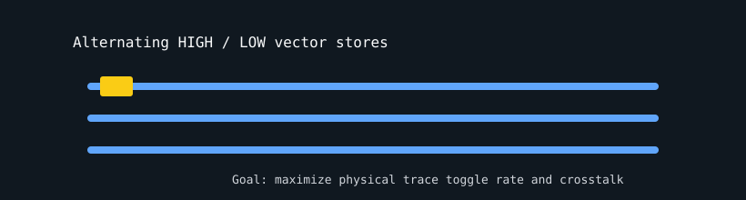

# Memory TSV Thrasher

`memory_tsv_thrasher` stresses physical memory traces by alternating all-high and all-low vector writes. The payload is intended to maximize toggle rate, DBI activity, current spikes, and crosstalk.



## What It Stresses

| Area | Stress mechanism |
| :--- | :--- |
| Data bus toggle rate | Alternates `0xFFFFFFFF` and `0x00000000`. |
| TSV/interposer paths | Large vector stores drive repeated electrical transitions. |
| Memory write bandwidth | 16x unrolled non-temporal stores sweep the allocation. |
| Data correctness | Optional verification checks alternating high/low payloads. |

## How It Works

1. The test allocates `--mem` percent of free VRAM.
2. Each active launch writes alternating high and low `uint4` patterns.
3. The 16x unroll keeps memory controllers busy.
4. With `--verify`, the written pattern is scanned for mismatches.

## Command Examples

```bash
pantheon --test memory_tsv_thrasher --gpu 0 --duration 30 --mem 90
```

## Runtime Parameters

| Parameter | Default | Effect |
| :--- | ---: | :--- |
| `block_size` | `256` | Threads per block. |
| `grid_size` | `0` | Number of blocks. `0` means auto-calculate. |
| `kernel_loops` | `10` | TSV sweep loops per launch. |
| `warmup_iters` | `5` | Warmup launches before telemetry. |
| `sync_mode` | `2` | `0=Spin`, `1=Yield`, `2=Block`. |
| `init_pattern` | `0` | Tail initialization: `0=Zeroes`, `1=Ones`. |

## Source

The implementation lives in [`memory_tsv_thrasher.cpp`](./memory_tsv_thrasher.cpp).
