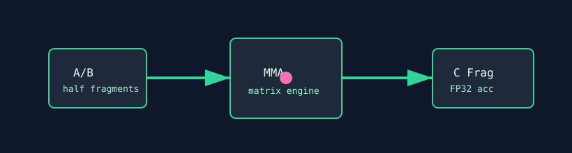

# MMA Virus

`mma_virus` stresses matrix multiply-accumulate hardware through WMMA/rocWMMA when supported. It uses half-precision matrix fragments with FP32 accumulation to target tensor/matrix units.



## What It Stresses

| Area | Stress mechanism |
| :--- | :--- |
| Tensor/MMA units | Repeated `mma_sync` operations. |
| FP16 input path | Half fragments feed the matrix engine. |
| FP32 accumulation | Accumulator fragments are checked bitwise. |
| Hardware support path | Skips cleanly when WMMA/rocWMMA is unavailable. |

## How It Works

1. The test creates matrix A, B, and accumulator fragments.
2. Fragment signs are selected by `init_pattern`.
3. Each launch performs unrolled MMA operations for `kernel_loops`.
4. With `--verify`, a golden MMA pass is compared bit-for-bit.

## Command Examples

```bash
pantheon --test mma_virus --gpu 0 --duration 30 --mem 99
```

## Runtime Parameters

| Parameter | Default | Effect |
| :--- | ---: | :--- |
| `block_size` | `256` | Threads per block. |
| `grid_size` | `0` | Number of blocks. `0` means auto-calculate. |
| `kernel_loops` | `10000` | WMMA iteration count. |
| `warmup_iters` | `5` | Warmup launches before telemetry. |
| `sync_mode` | `2` | `0=Spin`, `1=Yield`, `2=Block`. |
| `init_pattern` | `0` | `0=Positive fragments`, `1=Negative fragments`. |

## Source

The implementation lives in [`mma_virus.cpp`](./mma_virus.cpp).
