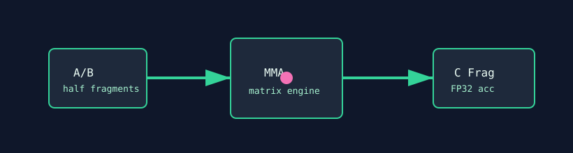

# MMA Virus

`mma_virus` stresses matrix multiply-accumulate hardware through WMMA/rocWMMA when supported. It uses half-precision matrix fragments with FP32 accumulation to target tensor/matrix units.



## What It Stresses

| Area | Stress mechanism |
| :--- | :--- |
| Tensor/MMA units | Repeated `mma_sync` into `mma_acc` independent accumulators. |
| FP16 input path | Half fragments feed the matrix engine. |
| FP32 accumulation | Accumulator fragments are checked bitwise. |
| Hardware support path | Skips cleanly when WMMA/rocWMMA is unavailable. |

## How It Works

1. The test creates matrix A, B, and accumulator fragments.
2. Fragment signs are selected by `init_pattern`.
3. Each launch performs unrolled MMA operations for `kernel_loops`.
4. With `--verify`, a golden MMA pass is compared bit-for-bit.

When the vendor BLAS loads (cuBLASLt, or hipBLASLt on AMD) the test runs matmuls through it instead of the WMMA kernel. `wmma::mma_sync` uses the synchronous MMA instructions and reached about 32% of peak on a B200; the BLAS uses the part's asynchronous matrix path. On 8x B200 the default BF16 GEMM ran at 1334 to 1373 TFLOPS per GPU, 7559 W for the node, 49 C peak; the WMMA kernel ran at 970 TFLOPS on one GPU. `--gemm 0` forces WMMA, and `mma_acc`, `mma_groups` and `mma_reuse` then do not apply.

With `--verify`, the first matmul output is the reference and later outputs must match it bit for bit. `--inject_error` flips one bit and is reported as a failure.

The format and shape flags, the `auto` rule and the AMD notes are described in the [`omni_virus` README](../omni_virus/README.md#vendor-gemm).

## Command Examples

```bash
pantheon --test mma_virus --gpu 0 --duration 30 --mem 99
```

## Runtime Parameters

| Parameter | Default | Effect |
| :--- | ---: | :--- |
| `block_size` | `256` | Threads per block. |
| `grid_size` | `0` | Number of blocks. `0` means auto-calculate. |
| `kernel_loops` | `10000` | WMMA iteration count. |
| `warmup_iters` | `5` | Warmup launches before telemetry. |
| `sync_mode` | `2` | `0=Spin`, `1=Yield`, `2=Block`. |
| `init_pattern` | `0` | `0=Positive fragments`, `1=Negative fragments`. |
| `mma_acc` | `16` | Accumulator fragments per warp: `2`, `4`, `8` or `16`. WMMA only. |
| `gemm` | `1` | Use the vendor GEMM when it can be loaded. `0` forces WMMA. |
| `gemm_type` | `auto` | `auto`, `bf16`, `fp16`, `tf32`, `fp32` or `fp8`. |
| `gemm_probe_ms` | `1500` | Per-format power probe used by `auto`. `0` skips it. |
| `gemm_margin` | `15` | Percent by which another format must beat the default for `auto` to switch. |
| `gemm_size`, `gemm_m`, `gemm_n`, `gemm_k` | `8192` | GEMM shape. |

## Why The Operands Come From Shared Memory

Fragments filled with a single constant let the multiplier array recompute
identical partial products every cycle. Dynamic power is switching activity,
so the pipe issues at full rate while drawing a fraction of what a real GEMM
draws, and the accumulator grows monotonically until the FP32 increment
vanishes into rounding and even the adder stops changing.

The fragments are now rotated through four tiles of uncompressible data in
shared memory, at about one reload per four MMAs, which is the operand-staging
ratio of a tiled GEMM. Reloading every fragment every group instead makes the
kernel LSU-bound and costs tensor throughput. Several accumulators run in
parallel because `mma_sync` into one accumulator serialises on its own
result. How many it takes to fill the pipe is a property of the part, so
`mma_acc` selects it: measured on a B200, 4 accumulators reached 540 W of a
1000 W board, 8 reached 677 W and 16 reached 696 W, hence the default of 16.
See [`toggle_chaos.h`](../common/toggle_chaos.h).

## Source

The implementation lives in [`mma_virus.cpp`](./mma_virus.cpp).
