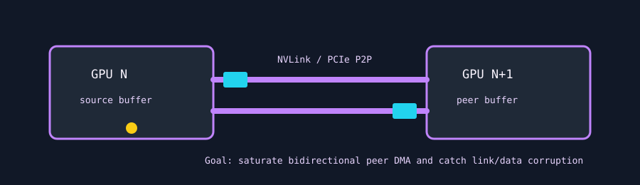

# P2P Thrasher

`p2p_thrasher` is an interconnect stress test. It copies a fixed GPU buffer back and forth between the selected GPU and its next peer GPU using asynchronous peer-to-peer DMA over NVLink or PCIe.



## What It Stresses

| Area | Stress mechanism |
| :--- | :--- |
| NVLink/PCIe fabric | Bidirectional peer copies between two GPUs. |
| DMA engines | Batched `hipMemcpyPeerAsync` transfers before synchronization. |
| Multi-GPU routing | Requires bidirectional peer access support. |
| Payload integrity | Optional verification checks the copied pattern after traffic. |

## How It Works

1. The test selects the peer GPU as `(primary_gpu + 1) % device_count`.
2. It verifies bidirectional peer access and skips cleanly if the topology cannot route P2P traffic.
3. A 256 MiB buffer is allocated on each GPU.
4. The source buffer is filled with a deterministic payload.
5. Each active loop performs `kernel_loops` forward and backward peer-copy batches.
6. With `--verify`, the final source buffer is checked for DMA corruption.

## Command Examples

```bash
pantheon --test p2p_thrasher --gpu 0 --duration 30 --mem 1
pantheon --test p2p_thrasher --gpu 0 --duration 30 --verify
```

## Runtime Parameters

| Parameter | Default | Effect |
| :--- | ---: | :--- |
| `block_size` | `256` | Threads per block for initialization and verification kernels. |
| `grid_size` | `0` | Number of blocks. `0` means auto-calculate from occupancy. |
| `kernel_loops` | `10` | Bidirectional DMA batches per synchronization. |
| `warmup_iters` | `5` | Warmup peer-copy iterations before telemetry. |
| `sync_mode` | `2` | `0=Spin`, `1=Yield`, `2=Block`. |
| `init_pattern` | `2` | `0=Zeroes`, `1=Ones`, `2=Verifiable entropy`. |

## Output And Interpretation

`Throughput` is reported in `GB/s` for combined bidirectional traffic. A result of `0.0 GB/s` with a skip message means the machine has only one GPU or the selected peer path does not support bidirectional P2P.

## Failure Signals

| Symptom | Possible meaning |
| :--- | :--- |
| Skipped test | No second GPU or no bidirectional P2P route. |
| Verification fault | DMA payload corruption, link instability, or injected fault. |
| Low GB/s | PCIe fallback, poor topology, link power state, or contention. |

## Source

The implementation lives in [`p2p_thrasher.cpp`](./p2p_thrasher.cpp).
