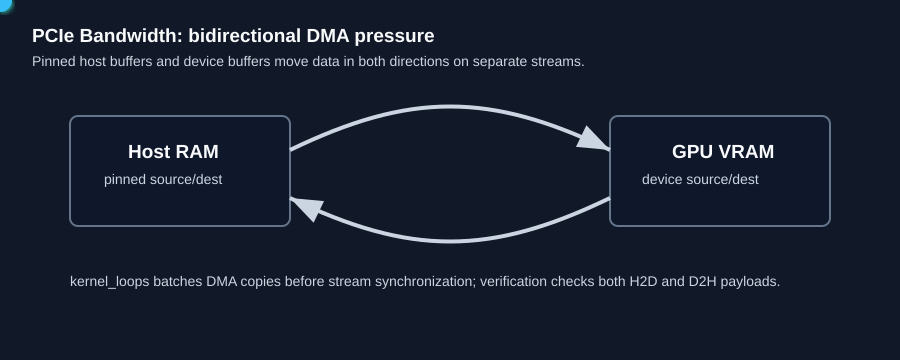

# PCIe Bandwidth

`pcie_bandwidth` is a bidirectional host/device DMA stress test. It allocates pinned host memory and GPU buffers, then continuously copies data host-to-device and device-to-host on separate streams.



## What It Stresses

| Area | Stress mechanism |
| :--- | :--- |
| PCIe or host link | Simultaneous upload and download copies. |
| DMA engines | Batched async transfers on two streams. |
| Host pinned memory | Large fixed host buffers are used as transfer endpoints. |
| Data integrity | Optional verification checks both directions. |

## How It Works

1. The test allocates 256 MiB pinned host source/destination buffers.
2. It allocates matching device source/destination buffers.
3. Host and device payloads are initialized with deterministic patterns.
4. Each active loop batches `kernel_loops` H2D and D2H async copies.
5. Both streams synchronize, bytes are counted, and throughput is reported in `GB/s`.

## Command Examples

```bash
pantheon --test pcie_bandwidth --gpu 0 --duration 30
pantheon --test pcie_bandwidth --gpu 0 --duration 30 --verify
```

## Runtime Parameters

| Parameter | Default | Effect |
| :--- | ---: | :--- |
| `block_size` | `256` | Threads per block for initialization/verification kernels. |
| `grid_size` | `0` | Number of blocks. `0` means auto-calculate. |
| `kernel_loops` | `10` | DMA copy batches per stream synchronization. |
| `warmup_iters` | `5` | Warmup DMA batches before telemetry. |
| `sync_mode` | `2` | `0=Spin`, `1=Yield`, `2=Block`. |
| `init_pattern` | `2` | `0=Zeroes`, `1=Ones`, `2=Verifiable entropy`. |

## Output And Interpretation

`Score` is reported in `GB/s` and includes both directions. Compare with expected PCIe generation and width in the summary. A dropped link width or generation usually matters more than raw compute metrics for this test.

## Failure Signals

| Symptom | Possible meaning |
| :--- | :--- |
| Low GB/s | PCIe downtraining, weak riser/cable, chipset path, or copy-engine contention. |
| Verification fault | DMA data corruption in H2D or D2H direction. |
| Stutter/system instability | Host bus, chipset, or power-management sensitivity. |

## Source

The implementation lives in [`pcie_bandwidth.cpp`](./pcie_bandwidth.cpp).
