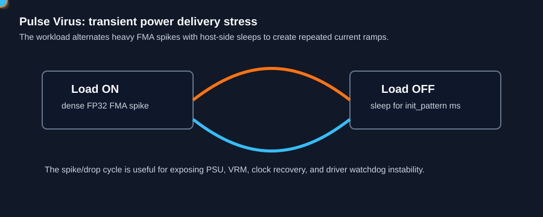

# Pulse Virus

`pulse_virus` is a transient power-delivery stress test. It repeatedly jumps from dense FP32 FMA load to an explicit sleep interval, creating rapid load changes that can expose PSU, VRM, clock recovery, and driver stability problems.



## What It Stresses

| Area | Stress mechanism |
| :--- | :--- |
| Power delivery | Rapid load-on/load-off current transitions. |
| FP32 ALUs | Heavy FMA spike during the active phase. |
| Clock recovery | Repeated transitions can reveal unstable boost or voltage behavior. |
| Silent data corruption | Optional verification checks accumulated raw-bit results. |

## How It Works

1. The kernel runs an unrolled FP32 FMA chain for `kernel_loops` iterations.
2. The host synchronizes, counts the work, then sleeps.
3. `init_pattern` is intentionally reused as sleep duration in milliseconds.
4. The cycle repeats until the requested duration expires.
5. With `--verify`, a golden pass predicts the accumulated raw-bit output.

## Command Examples

```bash
pantheon --test pulse_virus --gpu 0 --duration 30
pantheon --test pulse_virus --gpu 0 --duration 30 --verify
```

## Runtime Parameters

| Parameter | Default | Effect |
| :--- | ---: | :--- |
| `block_size` | `256` | Threads per block. |
| `grid_size` | `0` | Number of blocks. `0` means auto-calculate. |
| `kernel_loops` | `20000` | FMA work per spike. |
| `warmup_iters` | `5` | Warmup spikes before telemetry. |
| `sync_mode` | `2` | `0=Spin`, `1=Yield`, `2=Block`. |
| `init_pattern` | `50` | Sleep duration in milliseconds between spikes. |

## Output And Interpretation

`Score` is reported in `TFLOPS`, but the main value of this test is telemetry shape: peak power, power-limit reasons, clock oscillation, and stability during repeated transients.

## Failure Signals

| Symptom | Possible meaning |
| :--- | :--- |
| Instant shutdown or reset | PSU/OCP trip or severe VRM instability. |
| Repeated power limit | Board is hitting transient or sustained power caps. |
| Verification fault | ALU state mismatch under transient load. |

## Source

The implementation lives in [`pulse_virus.cpp`](./pulse_virus.cpp).
