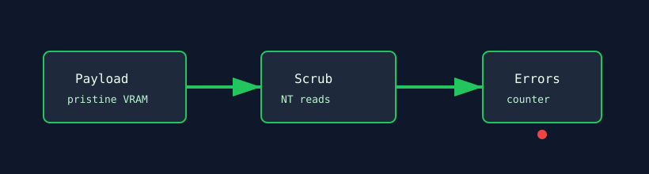

# RAS Validator

`ras_validator` is an ECC/RAS scrubber stress test. It writes a pristine payload, then repeatedly reads it with non-temporal loads to expose uncorrectable errors, silent corruption, or latency from active correction.



## What It Stresses

| Area | Stress mechanism |
| :--- | :--- |
| ECC/RAS path | Repeated physical-memory reads over a pristine payload. |
| Memory scrub behavior | Correctable errors can create latency jitter during reads. |
| Data integrity | Mismatches are counted in an error counter. |

## How It Works

1. The test allocates `--mem` percent of VRAM.
2. It writes a pristine zero, one, or `0xAAAA5555` payload.
3. The active loop repeatedly reads the buffer with non-temporal loads.
4. Any mismatch increments the error counter and fails verification.

## Command Examples

```bash
pantheon --test ras_validator --gpu 0 --duration 30 --mem 90 --verify
```

## Runtime Parameters

| Parameter | Default | Effect |
| :--- | ---: | :--- |
| `block_size` | `256` | Threads per block. |
| `grid_size` | `0` | Number of blocks. `0` means auto-calculate. |
| `kernel_loops` | `10` | Memory sweeps per launch. |
| `warmup_iters` | `5` | Warmup launches before telemetry. |
| `sync_mode` | `2` | `0=Spin`, `1=Yield`, `2=Block`. |
| `init_pattern` | `2` | `0=Zeroes`, `1=Ones`, `2=0xAAAA5555`. |

## Source

The implementation lives in [`ras_validator.cpp`](./ras_validator.cpp).
