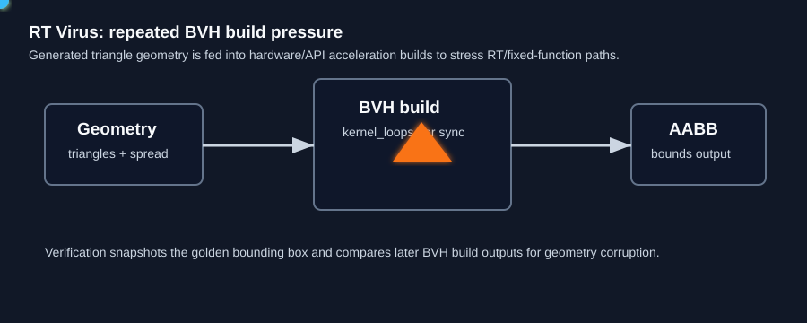

# RT Virus

`rt_virus` stresses ray-tracing acceleration paths by repeatedly building acceleration structures over generated triangle geometry. On NVIDIA it uses OptiX BVH builds. On AMD CDNA-class parts that lack hardware ray accelerators, it exits cleanly with zero throughput.



## What It Stresses

| Area | Stress mechanism |
| :--- | :--- |
| RT / BVH build path | Repeated acceleration-structure builds over large triangle sets. |
| Geometry setup | Generated vertex buffers with configurable spread/scale. |
| Driver/API stack | OptiX or platform fallback path is exercised repeatedly. |
| Data integrity | Optional AABB comparison checks BVH output bounds. |

## How It Works

1. The test creates generated triangle geometry on the GPU.
2. It initializes the platform RT/BVH API path.
3. It computes memory requirements and allocates temporary/output buffers.
4. Each active loop batches `kernel_loops` BVH builds before synchronization.
5. Throughput is reported as effective `GRays/s` based on builds and triangle count.

## Command Examples

```bash
pantheon --test rt_virus --gpu 0 --duration 30
pantheon --test rt_virus --gpu 0 --duration 30 --verify
```

## Runtime Parameters

| Parameter | Default | Effect |
| :--- | ---: | :--- |
| `block_size` | `256` | Threads per block for geometry setup. |
| `grid_size` | `0` | Number of blocks. `0` means auto-calculate. |
| `kernel_loops` | `10` | BVH builds per synchronization. |
| `warmup_iters` | `5` | Warmup BVH builds before telemetry. |
| `sync_mode` | `2` | `0=Spin`, `1=Yield`, `2=Block`. |
| `init_pattern` | `1` | Geometry scale/spread control. |

## Output And Interpretation

`Score` is reported in `GRays/s`. Treat it as an RT/BVH stress indicator rather than a general raster or gaming metric. Watch power, temperature, and driver stability alongside throughput.

## Failure Signals

| Symptom | Possible meaning |
| :--- | :--- |
| Clean zero throughput | Unsupported RT hardware/API path, such as CDNA guard path. |
| Verification fault | AABB mismatch after BVH build. |
| Driver/API error | RT stack, OptiX, or acceleration-structure build failure. |

## Source

The implementation lives in [`rt_virus.cpp`](./rt_virus.cpp).
