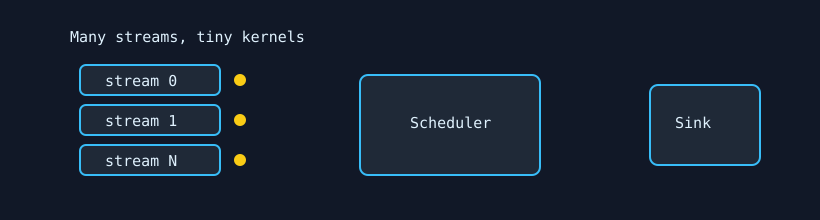

# Scheduler Virus

`scheduler_virus` stresses the GPU work scheduler with many tiny kernels across many streams. It is designed to exercise context loading, queue depth, Hyper-Q/ACE style scheduling, and launch accounting.



## What It Stresses

| Area | Stress mechanism |
| :--- | :--- |
| Hardware queues | Many streams submit tiny kernels. |
| Context switching | Short kernels force frequent load/unload behavior. |
| Launch ordering | Verification detects dropped or mis-scheduled launches. |

## How It Works

1. `grid_size` is repurposed as the number of concurrent streams.
2. `block_size` controls the micro-kernel fragment size.
3. `kernel_loops` controls launches per stream before synchronization.
4. `init_pattern` controls the micro-kernel inner loop count.
5. With `--verify`, accumulated per-stream results are compared with golden values.

## Command Examples

```bash
pantheon --test scheduler_virus --gpu 0 --duration 30 --mem 1
```

## Runtime Parameters

| Parameter | Default | Effect |
| :--- | ---: | :--- |
| `block_size` | `64` | Micro-kernel fragment size. |
| `grid_size` | `64` | Number of concurrent streams. |
| `kernel_loops` | `10` | Micro-kernel launches per stream per batch. |
| `warmup_iters` | `5` | Warmup scheduling batches. |
| `sync_mode` | `2` | `0=Spin`, `1=Yield`, `2=Block`. |
| `init_pattern` | `100` | Inner loop count for the micro-kernel. |

## Source

The implementation lives in [`scheduler_virus.cpp`](./scheduler_virus.cpp).
