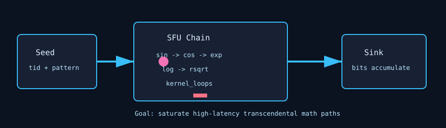

# SFU Stress

`sfu_stress` is a special-function-unit stress test. It drives high-latency transcendental math instructions such as `sin`, `cos`, `exp`, `log`, and `rsqrt` across many resident threads.



## What It Stresses

| Area | Stress mechanism |
| :--- | :--- |
| SFU pipelines | Repeated transcendental math chains. |
| Shared math resources | SFUs can share power or scheduling pressure with other GPU units. |
| Thermal behavior | Long-latency math can create a different heat profile than FMA-only tests. |
| Silent data corruption | Optional golden-pass verification compares per-thread bit accumulators. |

## How It Works

1. The test chooses a grid from `grid_size` or device occupancy.
2. Each thread seeds a transcendental chain from its thread ID and `init_pattern`.
3. The kernel repeats `sin`, `cos`, `exp`, `log`, and `rsqrt` for `kernel_loops` iterations.
4. Periodic perturbations keep the values from converging to a trivial steady state.
5. The final float bits are accumulated into a sink buffer.
6. With `--verify`, a golden kernel computes the expected per-thread value and the accumulated result is checked after the measured launches.

## Command Examples

```bash
pantheon --test sfu_stress --gpu 0 --duration 30 --mem 99
pantheon --test sfu_stress --gpu 0 --duration 30 --verify
```

## Runtime Parameters

| Parameter | Default | Effect |
| :--- | ---: | :--- |
| `block_size` | `256` | Threads per block. |
| `grid_size` | `0` | Number of blocks. `0` means auto-calculate from occupancy. |
| `kernel_loops` | `5000` | Transcendental chain iterations per launch. |
| `warmup_iters` | `5` | Warmup launches before telemetry. |
| `sync_mode` | `2` | `0=Spin`, `1=Yield`, `2=Block`. |
| `init_pattern` | `0` | Modulates starting scale and sign for the math chain. |

## Output And Interpretation

`Throughput` is reported in estimated `TFLOPS`, but this test is mostly about SFU pressure rather than ordinary FMA throughput. Watch core temperature, average power, and throttle reason; SFU-heavy tests can expose different weak points than FP32/FP64 math loops.

## Failure Signals

| Symptom | Possible meaning |
| :--- | :--- |
| Verification mismatch | Transcendental math corruption or injected fault. |
| Very low throughput | SFU saturation, clock throttling, or too many high-latency operations. |
| Different thermal result than FMA tests | SFU path is stressing a different silicon region or power domain. |

## Source

The implementation lives in [`sfu_stress.cpp`](./sfu_stress.cpp).
