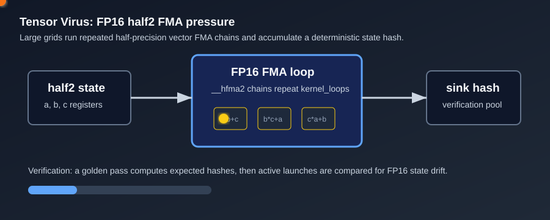

# Tensor Virus

`tensor_virus` is a half-precision arithmetic stress test. It uses `half2` FMA chains to create dense FP16 execution pressure and to expose tensor/matrix-style throughput, power, thermal, or verification failures.



## What It Stresses

| Area | Stress mechanism |
| :--- | :--- |
| FP16 math lanes | Repeated `__hfma2` operations across many threads. |
| Matrix/tensor resources | Large occupancy attempts to keep half-precision pipelines saturated. |
| Power and thermals | Sustained FP16 math can create high board power and rapid heat rise. |
| Silent data corruption | A golden pass and accumulated hash detect drift in FP16 arithmetic state. |

## How It Works

1. The test sizes a launch grid from `grid_size` or GPU occupancy.
2. Each thread initializes three `half2` values.
3. The kernel repeatedly applies `__hfma2` chains for `kernel_loops` iterations.
4. The final FP16 state is converted to a compact integer hash and accumulated in a sink buffer.
5. With `--verify`, a golden pass computes the expected hash and the verification kernel compares every participating thread.

## Command Examples

```bash
pantheon --test tensor_virus --gpu 0 --duration 30 --mem 99
pantheon --test tensor_virus --gpu 0 --duration 30 --verify
```

## Runtime Parameters

| Parameter | Default | Effect |
| :--- | ---: | :--- |
| `block_size` | `256` | Threads per block. |
| `grid_size` | `0` | Number of blocks. `0` means auto-calculate. |
| `kernel_loops` | `20000` | FP16 loop iterations per launch. |
| `warmup_iters` | `5` | Warmup launches before telemetry. |
| `sync_mode` | `2` | `0=Spin`, `1=Yield`, `2=Block`. |
| `init_pattern` | `0` | `0=Standard polarity`, `1=Inverted polarity`. |

## Output And Interpretation

`Score` is reported in `TFLOPS`. Watch `Max Power (W)`, `Avg Power (W)`, core/memory temperature, and `Limit Reason` to see whether the card is power limited, thermally limited, or simply constrained by FP16/tensor throughput.

## Failure Signals

| Symptom | Possible meaning |
| :--- | :--- |
| `Status=FAIL` with `--verify` | FP16 state hash mismatch or injected error. |
| High power with low TFLOPS | Clock throttling, occupancy limits, or tensor-path bottleneck. |
| Driver reset | Unstable clocks, power delivery issue, or thermal runaway. |

## Source

The implementation lives in [`tensor_virus.cpp`](./tensor_virus.cpp).
