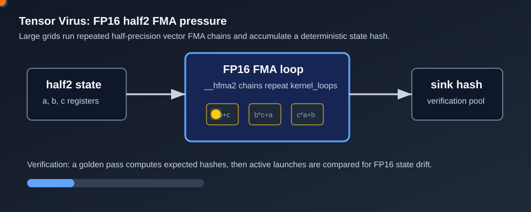

# Tensor Virus

`tensor_virus` is a half-precision arithmetic stress test. It uses `half2` FMA chains to create dense FP16 execution pressure and to expose throughput, power, thermal, or verification failures on the packed half-precision vector pipe. This is the FP16 ALU path, not the matrix cores; `mma_virus` covers those.



## What It Stresses

| Area | Stress mechanism |
| :--- | :--- |
| FP16 math lanes | Repeated `__hfma2` operations across many threads. |
| Packed FP16 pipe | Eight independent `__hfma2` chains per thread at large occupancy. |
| Power and thermals | Sustained FP16 math can create high board power and rapid heat rise. |
| Silent data corruption | A golden pass and accumulated hash detect drift in FP16 arithmetic state. |

## How It Works

1. The test sizes a launch grid from `grid_size` or GPU occupancy.
2. Each thread initializes three `half2` values.
3. The kernel repeatedly applies eight independent `__hfma2` chains for `kernel_loops` iterations.
4. The final FP16 state is converted to a compact integer hash and accumulated in a sink buffer.
5. With `--verify`, a golden pass computes the expected hash and the verification kernel compares every participating thread.

## Command Examples

```bash
pantheon --test tensor_virus --gpu 0 --duration 30 --mem 99
pantheon --test tensor_virus --gpu 0 --duration 30 --verify
```

## Runtime Parameters

| Parameter | Default | Effect |
| :--- | ---: | :--- |
| `block_size` | `256` | Threads per block. |
| `grid_size` | `0` | Number of blocks. `0` means auto-calculate. |
| `kernel_loops` | `20000` | FP16 loop iterations per launch. |
| `warmup_iters` | `5` | Warmup launches before telemetry. |
| `sync_mode` | `2` | `0=Spin`, `1=Yield`, `2=Block`. |
| `init_pattern` | `0` | `0=Standard polarity`, `1=Inverted polarity`. |

## Output And Interpretation

`Score` is reported in `TFLOPS`. Watch `Max Power (W)`, `Avg Power (W)`, core/memory temperature, and `Limit Reason` to see whether the card is power limited, thermally limited, or simply constrained by FP16/tensor throughput.

## Failure Signals

| Symptom | Possible meaning |
| :--- | :--- |
| `Status=FAIL` with `--verify` | FP16 state hash mismatch or injected error. |
| High power with low TFLOPS | Clock throttling, occupancy limits, or tensor-path bottleneck. |
| Driver reset | Unstable clocks, power delivery issue, or thermal runaway. |

## Why The Chain Looks Like This

Dynamic power is switching activity, so a furnace has to make its datapath
*toggle*, not merely issue. The previous chain failed that: seeded near 1.0 it
reached infinity after seven FP16 FMAs, after which every instruction recomputed the same
value at full issue rate while the die cooled. It also made `--verify`
vacuous, because a golden pass in that state compares a constant against the
same constant and cannot fail.

`x <- x*x + c` with `c` in `[-1.435, -1.4]` is chaotic and closed: `|x| <=
1.435` implies `x*x + c` lands back in the same interval, so it needs no clamp
and cannot saturate, and a real flipped bit diverges instead of healing. Each
thread runs several independent chains because one chain issues at most one
FMA per FMA latency. See [`toggle_chaos.h`](../common/toggle_chaos.h).

## Source

The implementation lives in [`tensor_virus.cpp`](./tensor_virus.cpp).
