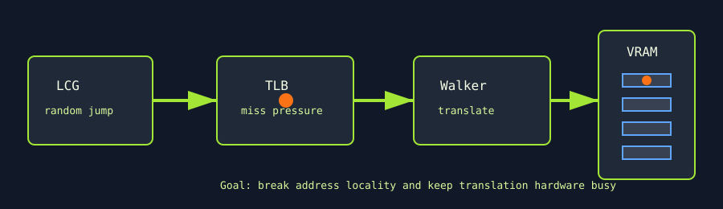

# TLB Avalanche

`tlb_avalanche` is an MMU and address-translation stress test. It allocates a large VRAM region and forces pseudo-random page jumps to maximize translation lookaside buffer misses and page-walker pressure.



## What It Stresses

| Area | Stress mechanism |
| :--- | :--- |
| TLB/MMU | Pseudo-random jumps across page-sized offsets. |
| Page walkers | Large allocation and nonlocal access pattern reduce translation locality. |
| VRAM reads | Each translated address reads a deterministic `uint4` payload. |
| Translation correctness | Optional golden-pass verification catches wrong-page reads. |

## How It Works

1. The test allocates `--mem` percent of free VRAM.
2. Initialization fills each `uint4` element with an address-derived pattern.
3. Each thread starts at a page-offset-based location.
4. A lightweight LCG generates the next pseudo-random page jump.
5. The thread reads one value per jump and accumulates a hash.
6. With `--verify`, a golden pass computes the expected hash and the measured launches are compared.

## Command Examples

```bash
pantheon --test tlb_avalanche --gpu 0 --duration 30 --mem 90
pantheon --test tlb_avalanche --gpu 0 --duration 30 --mem 90 --verify
```

## Runtime Parameters

| Parameter | Default | Effect |
| :--- | ---: | :--- |
| `block_size` | `256` | Threads per block. |
| `grid_size` | `0` | Number of blocks. `0` means auto-calculate from occupancy. |
| `kernel_loops` | `20000` | Pseudo-random page jumps per thread. |
| `warmup_iters` | `5` | Warmup launches before telemetry. |
| `sync_mode` | `2` | `0=Spin`, `1=Yield`, `2=Block`. |
| `init_pattern` | `0` | Page stride selector: `0=4KB`, `1=2MB`, `>1=custom uint4 stride`. |

## Output And Interpretation

`Throughput` is reported in `GB/s`, but lower throughput is expected here because the test intentionally destroys locality. A useful stress point is often one with poor bandwidth but elevated power, temperature, or throttle signals because the MMU/page-walk path is busy.

## Failure Signals

| Symptom | Possible meaning |
| :--- | :--- |
| Verification mismatch | Wrong-page translation, read corruption, or injected MMU fault. |
| Very high bandwidth | Access pattern may be too local for the selected stride. |
| Allocation failure | `--mem` is too high for the available VRAM headroom. |

## Source

The implementation lives in [`tlb_avalanche.cpp`](./tlb_avalanche.cpp).
