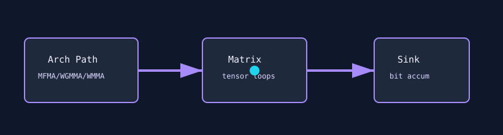

# Transformer Virus

`transformer_virus` targets modern matrix hardware with platform-specific tensor paths. It uses AMD MFMA, NVIDIA Hopper/Blackwell WGMMA, NVIDIA Volta-to-Ada WMMA, or a mock fallback depending on the compiler and architecture.



## What It Stresses

| Area | Stress mechanism |
| :--- | :--- |
| Transformer-style matrix units | MFMA, WGMMA, or WMMA paths depending on hardware. |
| Register pressure | Hopper path adds register thrashing around WGMMA. |
| Tensor accumulation | Bitcast accumulation preserves faults across launches. |
| Architecture routing | Compile-time paths select the relevant backend. |

## How It Works

1. The kernel selects an AMD CDNA, NVIDIA Hopper/Blackwell, NVIDIA legacy WMMA, or mock path.
2. `init_pattern` controls starting sign for matrix fragments.
3. The active loop performs repeated matrix operations for `kernel_loops`.
4. Results are bitcast and accumulated in a sink.
5. With `--verify`, accumulated values are checked against a golden launch.

## Command Examples

```bash
pantheon --test transformer_virus --gpu 0 --duration 30 --mem 99
```

## Runtime Parameters

| Parameter | Default | Effect |
| :--- | ---: | :--- |
| `block_size` | `256` | Threads per block. |
| `grid_size` | `0` | Number of blocks. `0` means auto-calculate. |
| `kernel_loops` | `1000` | Matrix loop iterations per launch. |
| `warmup_iters` | `5` | Warmup launches before telemetry. |
| `sync_mode` | `2` | `0=Spin`, `1=Yield`, `2=Block`. |
| `init_pattern` | `0` | `0=Positive`, `1=Negative` starting sign. |

## Source

The implementation lives in [`transformer_virus.cpp`](./transformer_virus.cpp).
